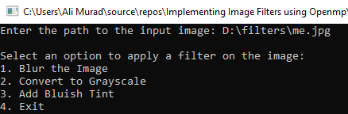
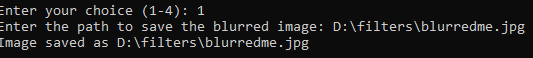
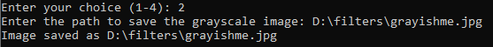
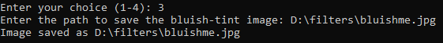
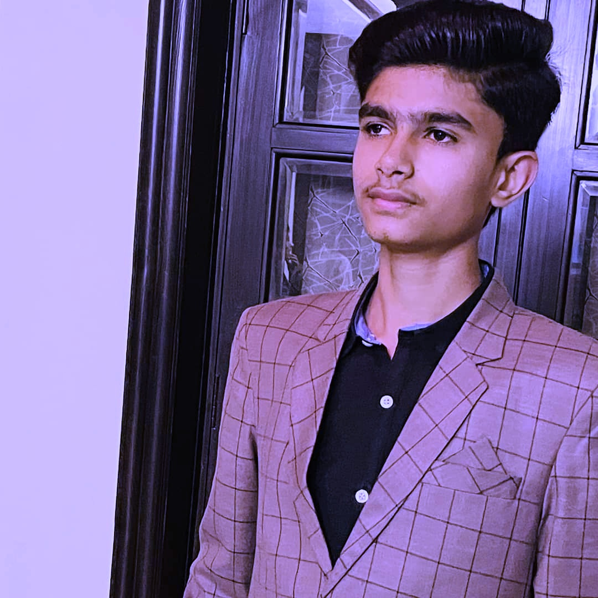

# Implementing Image Filters using OpenMP

This C++ project demonstrates the use of **OpenMP** to accelerate image processing tasks such as blurring, converting to grayscale, and adding a bluish tint. The project uses **OpenCV** for image operations and provides a simple console interface for users to choose filters and apply them to any input image.

---

## 🛠️ Features

- 📸 **Blur Filter** — Applies a Gaussian-like blur using parallel computation.
- 🖤 **Grayscale Filter** — Converts the image into grayscale using weighted RGB channels.
- 💙 **Bluish Tint Filter** — Enhances the blue channel to give a bluish tone.
- ⚡ **OpenMP Acceleration** — Filters are applied using parallel for-loops to boost performance.

---

## 🖼️ Screenshots

### 📋 Program Interface
| Screenshot | Description |
|------------|-------------|
|  | Input image prompt |
|  | Blur the Image |
|  | Convert to Grayscale |
|  | Add Bluish Tint |

### 🧪 Filter Outputs

| Filter Output | Description |
|---------------|-------------|
|  | Blurred image |
|  | Bluish tint applied |
|  | Grayscale image |

---

## 🚀 How to Run

1. Make sure **OpenCV** and **OpenMP** are installed and properly linked.
2. Compile the code using a compiler that supports OpenMP:
   ```bash
   g++ -fopenmp -o image_filters filters.cpp `pkg-config --cflags --libs opencv4`
